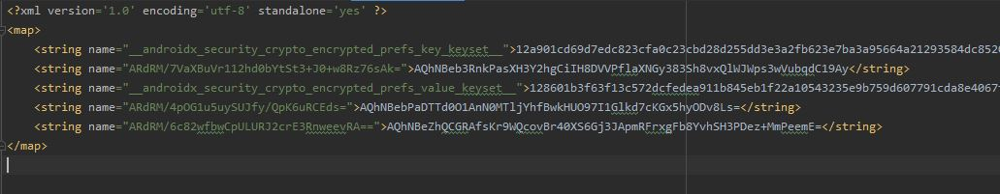
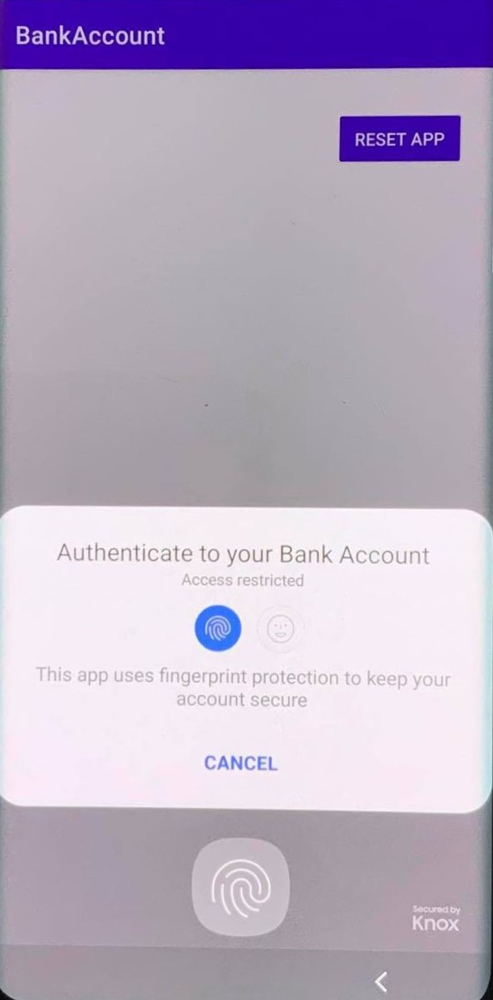
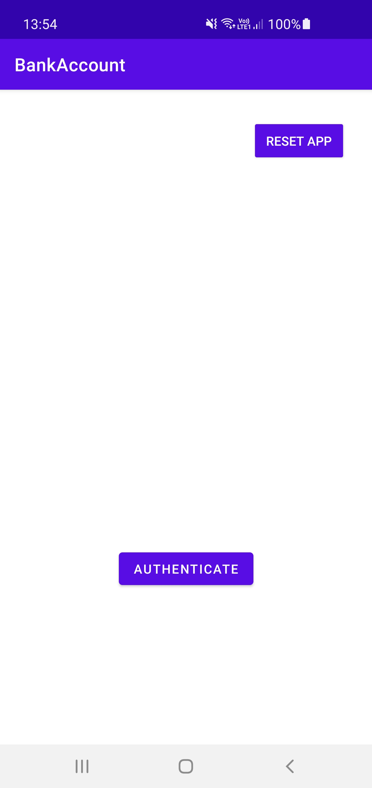
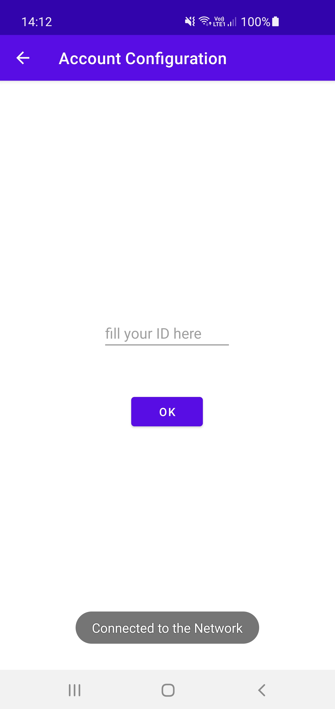
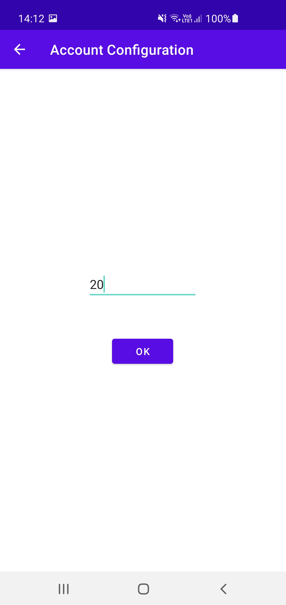
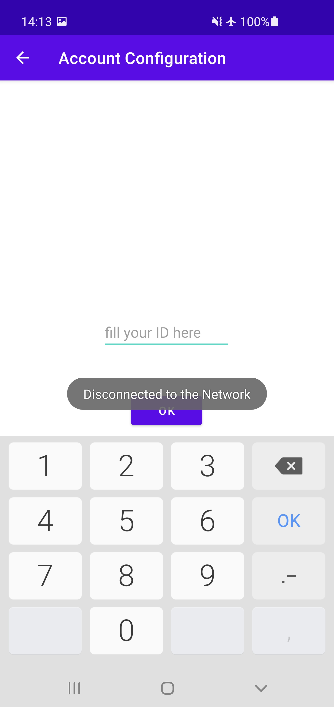
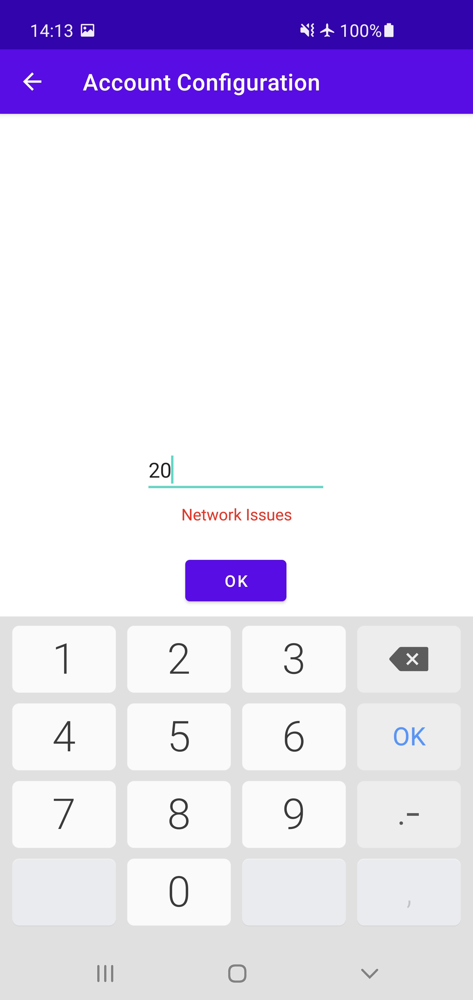
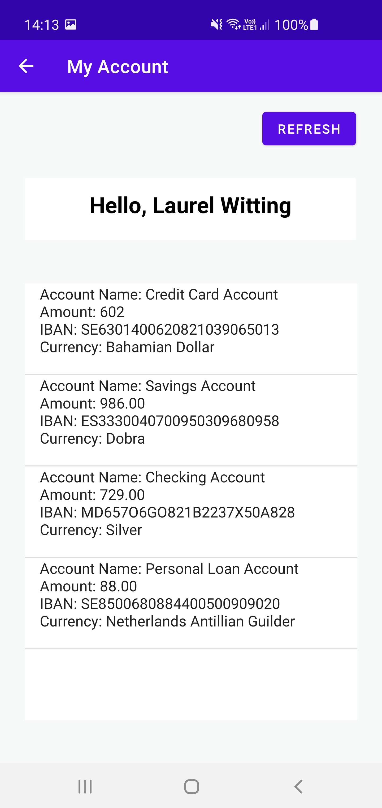

# Secure Development : Bank Mobile Applications

## Restricted access to the app

In order to check if user is the right one when starting the app, I opted for a biometric authentification.

When the user open the app for the first time, he has to authenticate with biometric, then he has to enter its bank account ID.
When he opens the app later he just needs to authenticate with biometric.

source : https://developer.android.com/training/sign-in/biometric-auth

## user's data securely saved on the phone

By following recommandations on this link : https://developer.android.com/topic/security/data#kotlin ,  I save data thanks to EncryptedSharedPreferences.

So, we can find files on the phone but datas are unreadable. See below : 

## API URL is hidden through the app

In fact, we want to hide our URL in order to avoid security issues.
That's why storing URL in a variable, in string.xml file or in gradle files is not enough because API key is recoverable by reverse engineering.

So, we have two choices : using Encrypted Shared Preferences or Android NDK.
After some research, NDK seems be a good choice (more difficult to decompile code), that's why I do this.

To sum up, in order to hide API URL I used:
 - NDK   (Native Development Kit, used to code in C and C++ i.e. native languages for Android)
 - CMake (open-source system that manages the build process in an operating system and a compiler-independent manner)

## Screenshots of your application 

